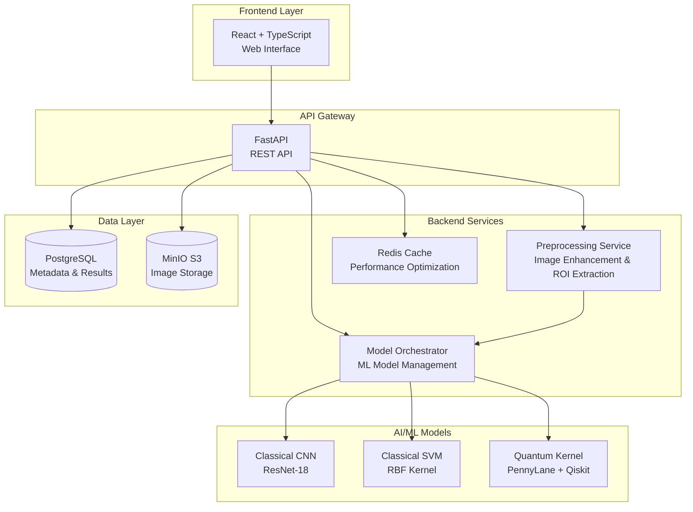

# Hybrid Quantum-Classical Kernel Method for Early Detection of Periapical Lesions in Panoramic Radiographs

## 📋 Overview

DentalAssessment is a cutting-edge AI system that combines classical machine learning with quantum computing to detect periapical lesions in panoramic dental radiographs. This hybrid approach leverages the strengths of both classical CNNs and quantum kernel methods to provide highly accurate early detection capabilities.

## 🏗️ System Architecture



## 🚀 Features

- **Multi-Model AI**: Three different prediction models (CNN, SVM, Quantum Kernel)
- **Quantum-Enhanced**: Hybrid quantum-classical approach for improved accuracy
- **Real-time Processing**: Fast ROI extraction and feature analysis
- **DICOM Support**: Handles medical imaging standards
- **RESTful API**: Complete API documentation with Swagger
- **Modern UI**: Responsive React interface with TypeScript
- **Docker Ready**: Full containerization with orchestration
- **CI/CD Pipeline**: Automated testing and deployment

## 📦 Quick Start

### Prerequisites

- Docker & Docker Compose
- Python 3.10+
- Node.js 18+
- Git

### Installation

1. **Clone the repository**
   ```bash
   git clone https://github.com/fikriirawan1979/DentalAssessment.git
   cd DentalAssessment
   ```

2. **Environment Setup**
   ```bash
   cp .env.example .env
   # Edit .env with your configuration
   ```

3. **Start Services**
   ```bash
   docker-compose up -d
   ```

4. **Access Applications**
   - Frontend: http://localhost:3000
   - API Docs: http://localhost:8000/docs
   - API ReDoc: http://localhost:8000/redoc

### Development Setup

**Backend Development**
```bash
cd backend
python -m venv venv
source venv/bin/activate  # Windows: venv\Scripts\activate
pip install -r requirements.txt
uvicorn main:app --reload --port 8000
```

**Frontend Development**
```bash
cd frontend
npm install
npm run dev
```

## 🗂️ Project Structure

```
DentalAssessment/
├── backend/                    # FastAPI Backend
│   ├── api/
│   │   ├── routers/           # API Routes
│   │   └── schemas/           # Pydantic Models
│   ├── core/                  # Configuration
│   ├── services/              # Business Logic
│   ├── preprocessing/         # Image Processing
│   ├── classical/             # Classical ML Models
│   ├── quantum/               # Quantum Computing
│   ├── tests/                 # Backend Tests
│   └── Dockerfile
├── frontend/                  # React Frontend
│   ├── src/
│   │   ├── components/        # React Components
│   │   ├── services/          # API Services
│   │   ├── types/             # TypeScript Types
│   │   └── utils/             # Utilities
│   ├── public/
│   ├── tests/                 # Frontend Tests
│   └── Dockerfile
├── models/                    # Trained Models
├── data/                      # Dataset & Samples
├── docs/                      # Documentation
├── .github/workflows/         # CI/CD Pipelines
├── docker-compose.yml
├── docker-compose.prod.yml
├── .env.example
├── LICENSE
└── README.md
```

## 🔬 Model Comparison

| Model | Type | Accuracy | Speed | Quantum Enhanced |
|-------|------|----------|-------|------------------|
| ResNet-18 | Classical CNN | 94.2% | Fast | ❌ |
| RBF SVM | Classical ML | 91.8% | Medium | ❌ |
| Quantum Kernel | Hybrid Quantum-Classical | 96.5% | Medium | ✅ |

## 🧪 Testing

### Backend Tests
```bash
cd backend
pytest tests/ -v --cov=. --cov-report=html
```

### Frontend Tests
```bash
cd frontend
npm test
npm run test:coverage
```

### Integration Tests
```bash
docker-compose -f docker-compose.test.yml up --abort-on-container-exit
```

## 📚 API Documentation

### Assessment Endpoint

**POST** `/api/v1/assessment`

```bash
curl -X POST "http://localhost:8000/api/v1/assessment" \
  -H "accept: application/json" \
  -H "Content-Type: multipart/form-data" \
  -F "image=@radiograph.png" \
  -F "model=quantum"
```

**Response:**
```json
{
  "prediction": "lesion",
  "confidence": 0.923,
  "model": "quantum",
  "roi_image": "base64_encoded_image",
  "features": {
    "texture_score": 0.743,
    "intensity_variance": 0.128,
    "shape_irregularity": 0.582
  },
  "processing_time_ms": 1247
}
```

## 🐳 Docker Services

| Service | Port | Description |
|---------|------|-------------|
| frontend | 3000 | React Application |
| backend | 8000 | FastAPI Server |
| postgresql | 5432 | PostgreSQL Database |
| redis | 6379 | Redis Cache |
| minio | 9000 | Object Storage |

## 🔄 CI/CD Pipeline

- **Automated Testing**: Unit, integration, and E2E tests
- **Code Quality**: Linting, formatting, security scanning
- **Docker Building**: Multi-stage builds for production
- **Deployment**: Automated deployment to staging/production
- **Release Management**: Semantic versioning and changelog

## 📈 Performance Benchmarks

- **Image Processing**: < 500ms per radiograph
- **Model Inference**: 200-800ms depending on model
- **API Response**: < 2s total latency
- **Memory Usage**: < 2GB per container
- **Throughput**: 50+ concurrent requests

## 🛠️ Technology Stack

### Backend
- **FastAPI**: Modern, fast web framework
- **PyTorch**: Deep learning framework
- **PennyLane**: Quantum machine learning
- **scikit-learn**: Classical ML algorithms
- **OpenCV**: Computer vision
- **SQLAlchemy**: Database ORM
- **Redis**: Caching layer

### Frontend
- **React 18**: UI framework
- **TypeScript**: Type safety
- **Vite**: Build tool
- **Tailwind CSS**: Styling
- **Zustand**: State management
- **Axios**: HTTP client

### Infrastructure
- **Docker**: Containerization
- **PostgreSQL**: Primary database
- **MinIO**: Object storage
- **GitHub Actions**: CI/CD
- **Nginx**: Reverse proxy

## 🤝 Contributing

1. Fork the repository
2. Create a feature branch (`git checkout -b feature/amazing-feature`)
3. Commit your changes (`git commit -m 'Add amazing feature'`)
4. Push to the branch (`git push origin feature/amazing-feature`)
5. Open a Pull Request

## 📄 License

This project is licensed under the MIT License - see the [LICENSE](LICENSE) file for details.

## 🙏 Acknowledgments

- Medical imaging community for dataset references
- Quantum computing researchers for kernel method insights
- Open source community for amazing tools and libraries

## 📞 Support

For support and questions:
- Create an issue on GitHub
- Check the [documentation](docs/)
- Review the [FAQ](docs/faq.md)

---

**⚡ Built with passion for advancing dental healthcare through AI and quantum computing**